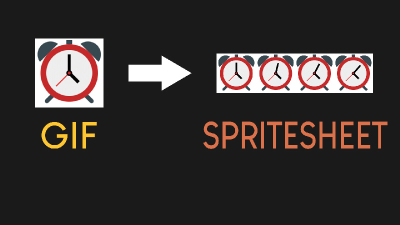

# Python GIF to Sprite Sheet

A Python script to convert an animated GIF image into a sprite sheet using Pillow. The outpuf file is ready to be used on an OLED Display (Monochrome of Color) with CircuitPython.
 
 In CircuitPython you are going to need the adafruit_imageload library to load and display the sprite sheet as an animated icon. Check this video for more info: 🎥 <a href="https://youtu.be/WqyBWcjs_oY">Animations on OLED</a>

# Video Tutorial of the Code

  

🎥 <a href="https://youtu.be/bTRD8E66Pew">Video Tutorial on YouTube</a>

 
 

| 📺 <a href="https://www.youtube.com/channel/UC3ivOTE5EgpmF2DHLBmWIWg">My YouTube Channel</a>
| 🌍 <a href="http://www.educ8s.tv">My Website</a> |  

